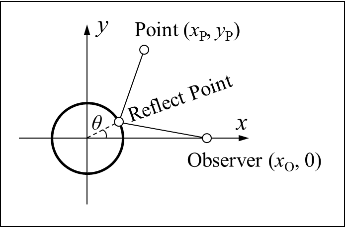

# 练习 2. 圆柱面反射

## 题目描述

在物理光学模拟、计算机图形学等领域，一个常见的问题是求镜面反射中像的位置。对于平面镜面
而言这是个简单的问题，但对于其他形状的镜面就不是了，比如圆柱形镜面（如图）。编写计算机程序求解圆柱形镜面反射中像的位置的问题。为了让问题更简单，我们将反射过程限制在二维平面上。



在这里，我们约定圆柱的半径为 $1$，保证 $x_\mathrm O > 1$，点 Point 在圆外（不含圆上），且 $x_\mathrm P \geq 0$，$y_\mathrm P \geq 0$。

## 输入

一行，三个浮点数，$x_\mathrm O$、$x_\mathrm P$、$y_\mathrm P$。

## 输出

一行，角度 $\theta$，用角度制输出。可以用 `%.3lf` 输出。

## 样例输入

```plain
5.0 0.0 2.0
```

## 样例输出

```plain
53.130
```
