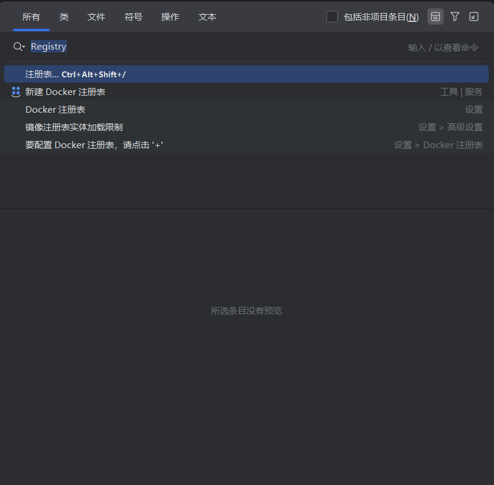

# CLion FAQs

## VSCode 使用 CLion 自带 gdb 的中文路径支持问题

有同学可能喜欢用 VSCode **复用** CLion 的 MinGW 和 gdb，但是 gdb 调试器默认不支持中文路径，CLion 使用了自己的调试桥接层，对路径做了额外的 Unicode 处理和转义，而 VS Code 的 C/C++ 扩展（cpptools）通过 Microsoft 的调试适配器（WindowsDebugLauncher.exe） 调用 GDB；
它向 GDB 发送标准的 Machine Interface (MI) 命令，例如：

```gdb
-environment-cd "你的中文项目路径"
```

而 Windows 上对 -environment-cd 中的非 ASCII 路径支持不完善；即使路径存在，GDB 内部调用 chdir() 时也可能因 locale 或宽字符转换失败而报错 "No such file or directory"

### 解决方案

目前为止除了换调试器没有什么好的解决方案（gdb 真不如 MSVC 吧），有一个可能得解决方案如下：

在 launch.json 中手动使用短路径（8.3 格式）作为 gdb 的文件路径输入：

```json
"program": "D:\\DA87~1\\DA33~1\\SHANG~1\\ZHUJI~1\\ZUOYE~1\\${fileBasenameNoExtension}.exe",
"cwd": "D:\\DA87~1\\DA33~1\\SHANG~1\\ZHUJI~1\\ZUOYE~1"
```

具体的 tasks.json 和 launch.json 文件的示例写法见附录。

## CLion 中文输出乱码问题

CLion 的中文支持一直是一个大问题，目前有三种解决办法：

### 1. 更改文件编码

将右下角的 "UTF-8" 改为 "GBK"

### 2. 修改 Windows 的默认编码为 UTF-8 （不建议）

STFW

### 3. 设置 Clion 不使用它的 pty

搜索框中输入 Registry ，选择 Registry... （对应中文版是 注册表...）



找到 `run.processes.with.pty`，去掉右边的勾并保存重启 CLion 即可（看起来很危险的操作，实际上这项功能十分的鸡肋，没什么用，本来就应该关掉。）


## 附录

使用 MSVC 的 launch.json 文件：

```json
{
  "version": "0.2.0",
  "configurations": [
    {
      "name": "C/C++: cl.exe launch active file",
      "type": "cppvsdbg",
      "request": "launch",
      "program": "${fileDirname}\\${fileBasenameNoExtension}.exe",
      "args": [],
      "stopAtEntry": false,
      "cwd": "${fileDirname}",
      "environment": [],
      "console": "externalTerminal"
    }
  ]
}
```

使用 MSVC 的 tasks.json 文件（这里第一个键值对是一个 clean 的小功能，基于后缀名清除编译/调试过程中的所有中间产物）：

```json
{
  "version": "2.0.0",
  "tasks": [
    {
      "label": "clean: all build files in folder",
      "type": "shell",
      "command": "del /Q *.exe *.pdb *.obj *.ilk *.manifest *.exp *.lib *.dll 2>nul",
      "options": {
        "cwd": "${fileDirname}",
        "shell": {
          "executable": "cmd.exe",
          "args": ["/c"]
        }
      },
      "group": "build",
      "presentation": {
        "echo": true,
        "reveal": "silent",
        "focus": false,
        "panel": "shared"
      },
      "problemMatcher": []
    },
    {
      "type": "cppbuild",
      "label": "C/C++: cl.exe 生成活动文件",
      "command": "cl.exe",
      "args": [
        "/Zi",
        "/EHsc",
        "/nologo",
        "/Fe${fileDirname}\\${fileBasenameNoExtension}.exe",
        "${file}"
      ],
      "options": {
        "cwd": "${fileDirname}"
      },
      "problemMatcher": ["$msCompile"],
      "group": {
        "kind": "build",
        "isDefault": true
      },
      "detail": "调试器生成的任务。"
    }
  ]
}
```
