# IDE 安装教程

强烈建议各位去 Github 上进行[学生认证](https://github.com/education)，会有很多福利和优惠，比如 JetBrains 全家桶的专业版，免费申请一些域名等。

## CLion 安装

JetBrains 是一家总部位于荷兰的软件开发公司，成立于 2000 年，其最为人所熟知的产品是 Java 编程语言开发撰写时所用的集成开发环境：IntelliJ IDEA

2025 年 5 月 8 日晚，JetBrains 发布公告，宣布 CLion（2025.1.1 之后的版本） 现在针对非商业用途免费开放，只需注册账号就可以了。~~学长们之前还用过盗版~~

选择对应系统和架构的[安装包](https://www.jetbrains.com/clion/download)下载安装即可。

???+ question "在 Ubuntu 16.04 or later 上有无更简单的安装？"

    有的兄弟，有的，这么简单的安装方式只需要一行命令就行 `sudo snap install clion --classic`

    不过 snap 的包管理不是好文明，不建议用

### Example

以 Windows 11 上的安装为例：

从[https://download.jetbrains.com/cpp/CLion-2025.2.1.exe](https://download.jetbrains.com/cpp/CLion-2025.2.1.exe)上下载好之后打开，遇到下图所示界面时可以根据喜好选择，也可以跟下图保持一致：

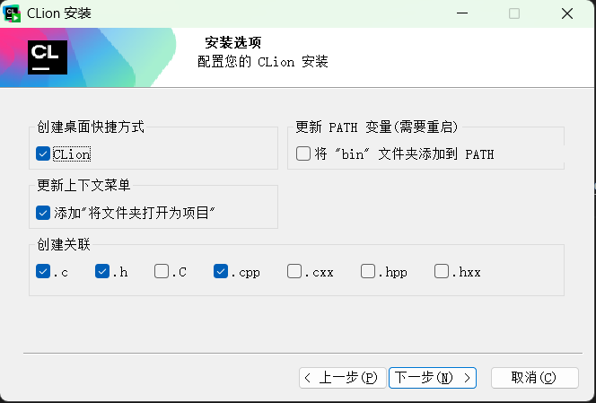

然后点两次下一步就可以安装了（大概 5 分钟左右）。

### 安装后配置

如果你之前使用过 VSCode 或者 JetBrains 公司别的软件（如 IntelliJ IDEA、PyCharm、WebStorm、Rider 等），
可以直接导入此前的设置，也可 Skip Import。登录后选择 Non-commercial use 可领取为期一年的许可证（放心，到期了也可以再续）

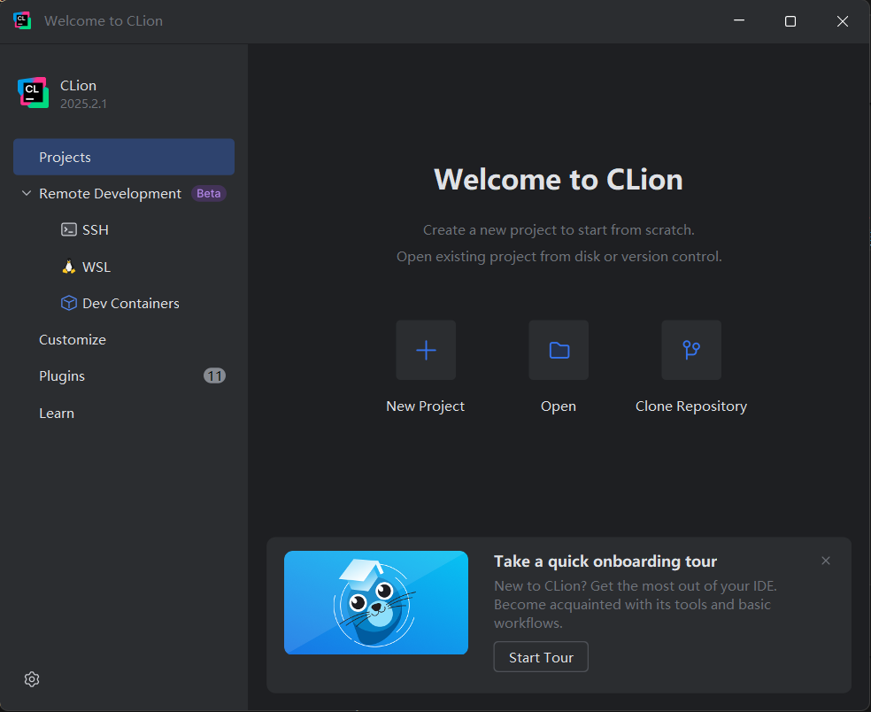

???- question "想要中文怎么办？"

    学习编程不建议使用中文，英文看习惯了就好了

    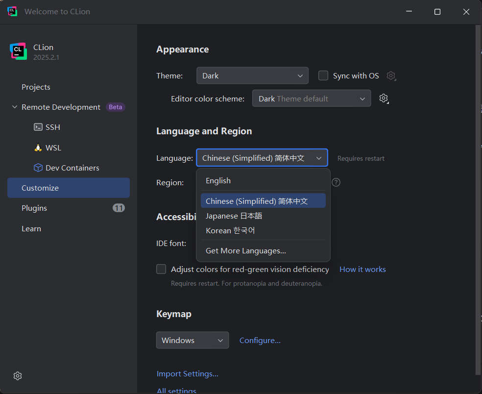

### New Project

新建一个示例项目：

CLion 相比于其他 IDE 的好处是工具链全部都捆绑安装好了：

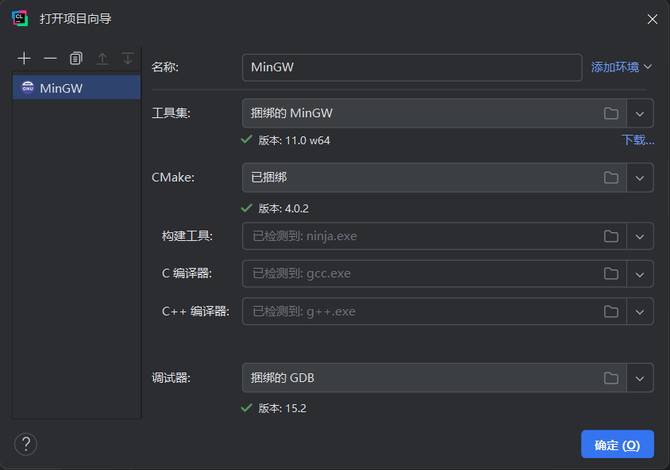

点击右上角的运行即可运行示例代码：

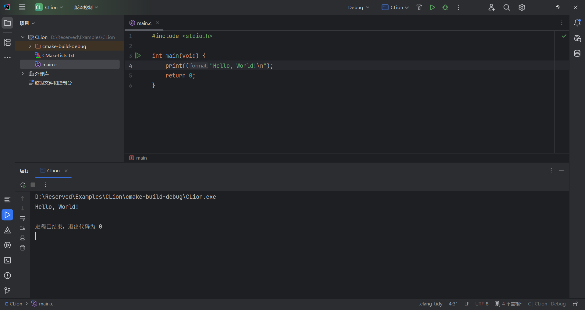

???+ question "CLion 这么好，那有没有什么坏处呢？"

    有的有的，CLion 的缺点有如下几点：

    1. 几乎所有 JetBrains 的 IDE 都会运行着一个 jvm，因此内存占用较大

    2. CLion 默认使用 CMake 进行构建，而且是基于整个项目进行构建，想要单文件运行可能需要手动更改 CMakeLists 文件，不过 CLion 也提供了单文件运行的选项，在对应的 main.c 文件的 main 函数中右键即可看到。

    但是瑕不掩瑜，CLion 仍然是配置最简单，最容易上手的 C/C++ IDE

更多设置或插件建议自己摸索，这里就不一一细说了。

## VSCode + MinGW 安装

Visual Studio Code (VSCode) 是一款由微软开发的开源代码编辑器，因其强大的功能和灵活性，受到广大开发者的喜爱。

### VSCode 安装

[https://code.visualstudio.com/Download](https://code.visualstudio.com/Download) 下载vscode

建议选上所有内容
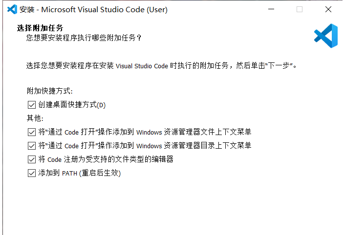

安装中文语言包(根据提示重启IDE即可)
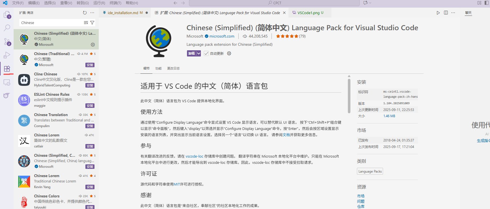

安装C/C++ for Visual Studio Code

???+ question "vscode功能多，那有没有什么坏处呢？"

    专业功能有限: 对于复杂的大型项目管理或专业的IDE特性的支持不如一些商业IDE如Eclipse或IntelliJ IDEA全面。

### VSCode调试

选中左侧进入debug页面
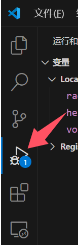

代码左侧点击某一行开头处，出现红点，设置完成
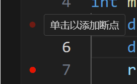

按 F5 开始调试
程序会在断点1处停止

按 F5 继续

???+ question "快捷键有哪些？"
    
    F5 - 继续执行到下一个断点

    F10 - 单步执行（不进入函数内部）

    F11 - 单步执行（会进入函数内部）

    Shift + F5 - 停止调试

    Ctrl + Shift + F5 - 重启调试

### MinGW 安装

下载MinGW
[https://sourceforge.net/projects/mingw-w64/](https://sourceforge.net/projects/mingw-w64/)

配置环境变量

win+R 输入 sysdm.cpl
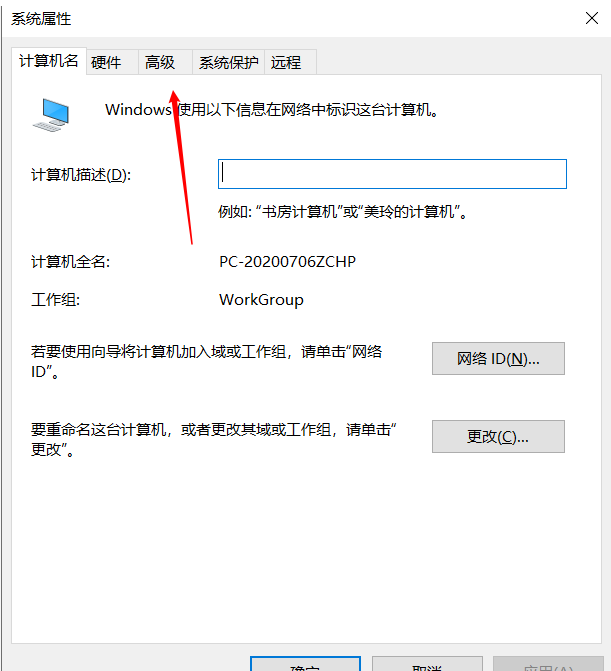

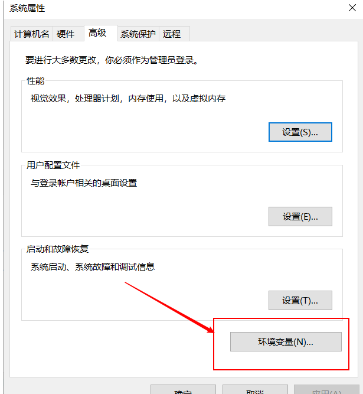

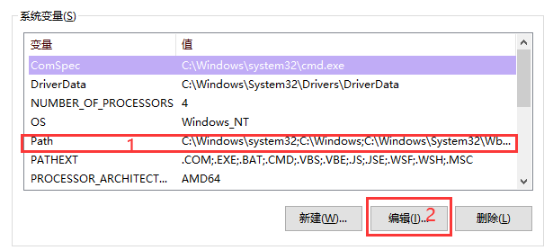

找到你刚才解压的mingw文件中的bin文件夹，复制绝对地址（...\mingw64\bin）,点击新建后左边输入之前复制的mingw的地址,点击确定
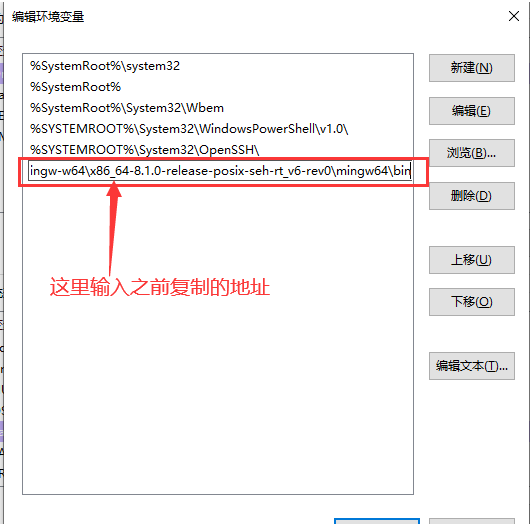

按win + R打开运行后输入cmd打开命令提示符，输入gcc --version查看是否成功
